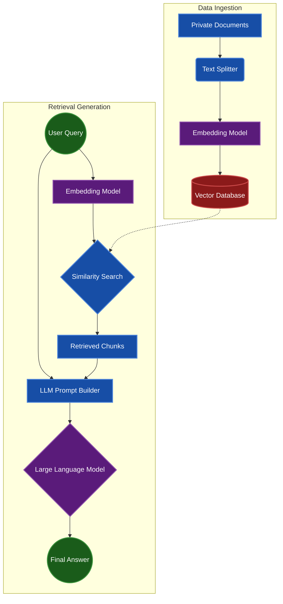

# RAG Pipeline Architecture

This document outlines the standard architecture for a Retrieval-Augmented Generation (RAG) system, as covered in **Phase 1: Foundations** and expanded in **Phase 2: Deep AI**.

## Core System Flow

The RAG pipeline solves the "hallucination problem" by forcing the Large Language Model to construct its answer strictly from retrieved knowledge context rather than relying on its parametric memory.

## Key Components

1. **Document Loader & Splitter:** Handles messy inputs (PDFs, Markdown, raw text). Chunks text into manageable overlaps (e.g., 1000 tokens with 200 token overlap) to preserve context boundaries.
2. **Embedding Model:** Transforms text chunks into high-dimensional vectors. (e.g., `text-embedding-ada-002` or open-source `bge-large-en`).
3. **Vector Database:** Specialized data store (like ChromaDB, Pinecone, or FAISS) optimized for fast Approximate Nearest Neighbors (ANN) searches.
4. **LLM Synthesis:** The retrieved contexts are prepended to the user query with strict instructions to "answer only using the provided context."
