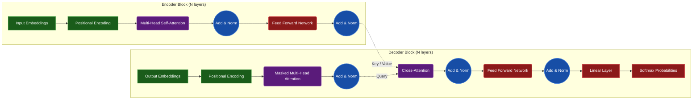

# The Transformer Architecture

This document visually breaks down the Transformer architecture, the foundational model of modern AI, as explored in **Phase 2: Deep AI (Let's build GPT)**.

## Core Encoder-Decoder Flow

First proposed in the 2017 paper *"Attention Is All You Need"*, the transformer removed recurrent layers entirely, relying exclusively on an attention mechanism to model global dependencies.

## Attention Mechanism (Scaled Dot-Product)
At the heart of the transformer is the self-attention formula:
`Attention(Q, K, V) = softmax( (Q·K^T) / sqrt(d_k) ) V`

- **Q (Query):** What the current token is looking for.
- **K (Key):** What information the token holds.
- **V (Value):** The actual information.
- The dot product between Query and Key determines the "attention score" or relevance between any two tokens in the sequence.
