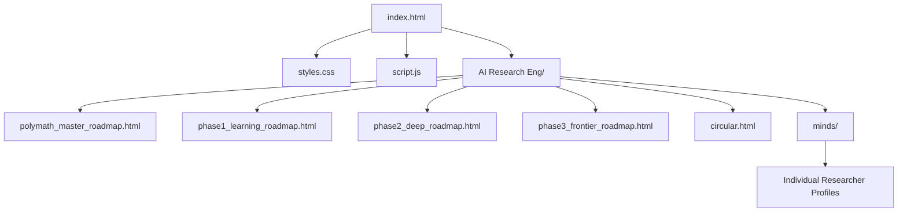
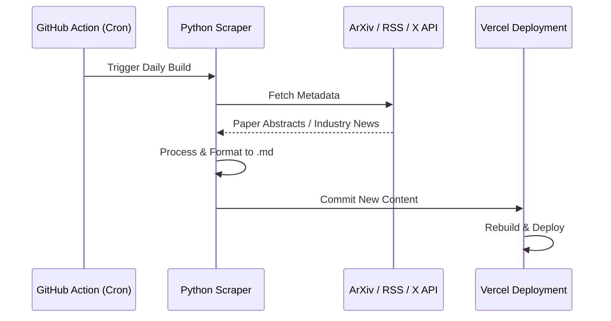

# MASTER SYSTEM BLUEPRINT: POLYMATH.SYS
**Vision: The Elite AI, Math & Quantum Research Portal**

---

## Executive Summary
Polymath.Sys is a premium, high-performance archival and curriculum platform designed for elite researchers. It leverages a "Brutalist-Premium" aesthetic to provide a distraction-free, high-utility environment for a 48-month deep-learning journey.

---

## 1. Current Architecture (v3.0)
The system is currently built on a **Monolithic Static Stack** for maximum delivery speed and zero-latency interaction.

### File Hierarchy

### Design Identity (DNA)
| Attribute | Specification | Rationale |
| :--- | :--- | :--- |
| **Color Space** | Charcoal (#0b) & Pitch Black (#00) | Reduces eye-strain; prioritizes focus. |
| **Typography** | Inter (Sans) & Monospace (System) | High legibility meets "Engineering" feel. |
| **Grids** | Flexbox & CSS Grid (Bento Style) | Modern, variable-density information. |
| **Interactives** | Mermaid.js & 3D CSS Transforms | Visualizes complex data without page loads. |

---

## 2. Immediate Scaling Roadmap (The Astro Core)
To handle blogs, news, and automated updates, we will migrate to **Astro**.

### Component-Based Model
We will extract recurring UI elements into reusable `.astro` components:
1. **Layout**: One base layout for all pages.
2. **Nav**: Cross-navigation logic handled in one place.
3. **Card**: Standardized data cards for repos, news, and papers.

### Content Collections (The Data Layer)
Instead of manual HTML editing, we will use Markdown (`.md` / `.mdx`):
- `src/content/roadmap/phase1.md`
- `src/content/blog/deep-research-01.md`
- `src/content/news/arxiv-updates.md`

---

## 3. Automation & Intelligence Layer
This section outlines the logic for the automated extraction of industry updates.

### Automated News Pipeline

---

## 4. Feature Extensions
The following modules are planned for integration:

### A. Repository Ranking System
- **Metric**: Star Growth Velocity + Contributor Activity.
- **Integration**: GitHub API fetched during static build.

### B. Career & Industry Board
- **Data Source**: Web-scraping of AI job postings from (OpenAI, DeepMind, Anthropic).
- **Categorization**: Grouping by Research, Engineering, and Alignment roles.

### C. Live Research Tracker
- **Visual**: A timeline View of SOTA (State of the Art) advancements across LLMs and QML.

---

## 5. Agent Instructions (Primer)
*Instruction for future agents and developers:*

> [!IMPORTANT]
> **Maintain the Aesthetic**: Never use vibrant colors. Use gradients only for surface depth.
> **Performance First**: Always favor native CSS/HTML over heavy JS libraries. 
> **Structure**: Keep the directory flat and clean. Use relative paths for all local assets.
